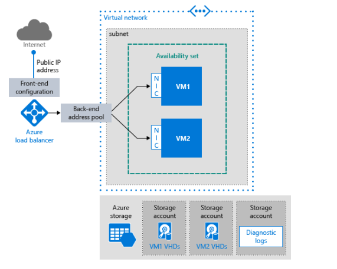

# Overview - Running multiple VMs on Azure for scalability and availability

## Description
This configuration is meant for running multiple instances with the same VM image.  The intended scenario is a single-tier app, such as a stateless web app or storage cluster, using multiple instances for scalability and availability.  Multi-tier applications are not included.

In this architecture, the workload is distributed across the VM instances. There is a single public IP address, and Internet traffic is distributed to the VMs using a load balancer. This architecture can be used for a single-tier app, such as a stateless web app or storage cluster. It is also a building block for N-tier applications.

## Architecture diagram

## Prescriptive Guidance
Prescriptive  guidance plus considerations for availability, manageability, and security is available [here](https://azure.microsoft.com/en-us/documentation/articles/guidance-compute-multi-vm/).

## Related Training
* [Running multiple Windows VMs on Azure](https://azure.microsoft.com/en-us/documentation/articles/guidance-compute-multi-vm/)
* [Networking basics for building applications in Azure](Networking basics for building applications in Azure)
* [Microsoft Azure Fundamentals:  Configure an Availability Set](https://azure.microsoft.com/en-us/documentation/articles/guidance-compute-single-vm/#architecture-diagram)

## Tools
* [Installing the Azure CLI](https://azure.microsoft.com/en-us/documentation/articles/xplat-cli-install/)
* [Installing and configuring Azure PowerShell](https://azure.microsoft.com/en-us/documentation/articles/powershell-install-configure/)

## Deployment
* Sample Solution
* PowerShell
* CLI
