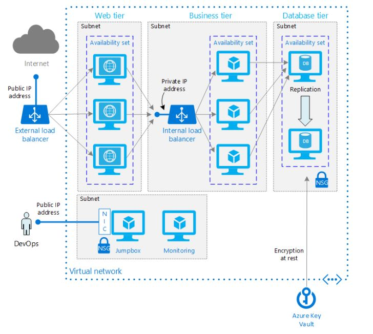

# Running VMs for an N-tier architecture on Azure

## Description
This configuration runs virtual machines (VMs) for an application with a N-tier architecture.
There are variations of N-tier architectures. A typical 3-tier web app is assumed here:
* Web tier. Handles incoming HTTP requests. Responses are returned through this tier.
* Business tier. Implements business processes and other functional logic for the system.
* Data tier. Provides persistent data storage.

 

## Prescriptive Guidance
Prescriptive  guidance plus considerations for availability, manageability, and security is available [here](https://azure.microsoft.com/en-us/documentation/articles/guidance-compute-3-tier-vm/).

## Related Training
* [Azure Network Security Groups (NSGs)](https://azure.microsoft.com/en-us/documentation/articles/virtual-networks-nsg/)
* [Adding reliability to an N-tier architecture on Azure](https://azure.microsoft.com/en-us/documentation/articles/guidance-compute-n-tier-vm/)
* [Networking basics for building applications in Azure](https://azure.microsoft.com/en-us/documentation/videos/azurecon-2015-networking-basics-for-building-applications-in-azure/)
* [Microsoft Azure Fundamentals:  Configure an Availability Set](https://azure.microsoft.com/en-us/documentation/articles/virtual-machines-windows-create-availability-set/)

## Tools
* [Installing the Azure CLI](https://azure.microsoft.com/en-us/documentation/articles/xplat-cli-install/)
* [Installing and configuring Azure Powershell](https://azure.microsoft.com/en-us/documentation/articles/powershell-install-configure/)

## Deployment

The template is set up to deploy a 3-tier sample web application to demonstrate the template’s functionality. Users can deploy infrastructure only, without the sample application, by changing the deployment switch in the template from “1” to “0.”  Instructions for deploying via the Deploy to Azure button, both with and without the sample application, are [included here](./DeployToAzure.md). To deploy using Powershell or CLI without the sample application, the deployment switch must be manually changed.

### Deploy using the Azure Portal
[](https://valoremconsulting.github.io/AzureCLI/redirect.html)

You will need to be logged into the Azure portal under the subscription you would like to use.

### PowerShell
```PowerShell
New-AzureRmResourceGroup           -ResourceGroupName YourResourceGroup3 -location "Central US"
New-AzureRmResourceGroupDeployment -ResourceGroupName YourResourceGroup3 -TemplateUri "https://clijsonpublic.blob.core.windows.net/ntier-stageartifacts/azuredeploy.json" -TemplateParameterUri "https://clijsonpublic.blob.core.windows.net/ntier-stageartifacts/azuredeploy.parameters.json"

```
[Install and configure Azure PowerShell](https://azure.microsoft.com/en-us/documentation/articles/powershell-install-configure/)

### CLI
```
azure group create            -n "YourResourceGroup3" -l "Central US"
azure group deployment create -g "YourResourceGroup3" -f "https://raw.githubusercontent.com/ValoremConsulting/AzureCLI/master/3-nTier/Templates/azuredeployGitHub.json" -p "{\"deploySwitch\":{\"value\":1}}"

```
[Install and Configure the Azure Cross-Platform Command-Line Interface](https://azure.microsoft.com/en-us/documentation/articles/xplat-cli-install/)

